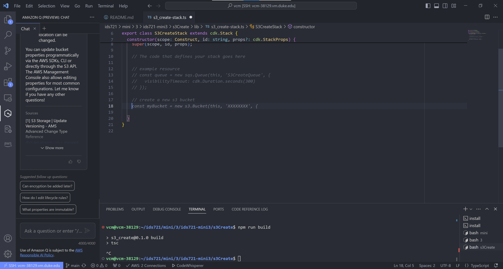
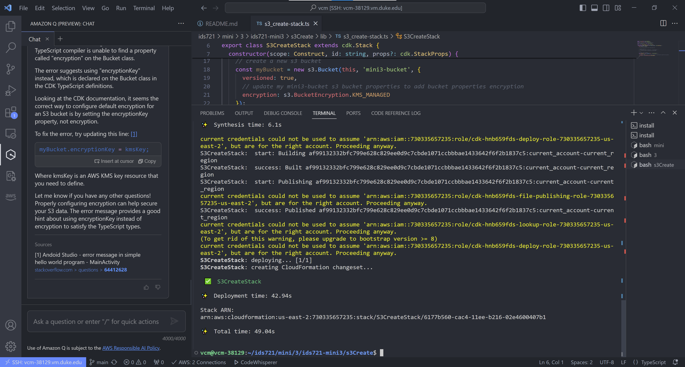
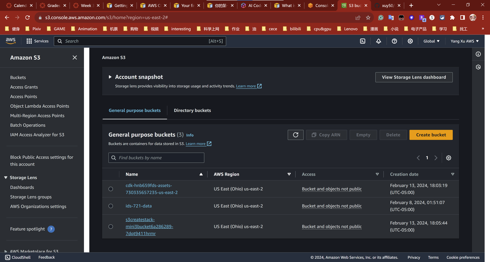
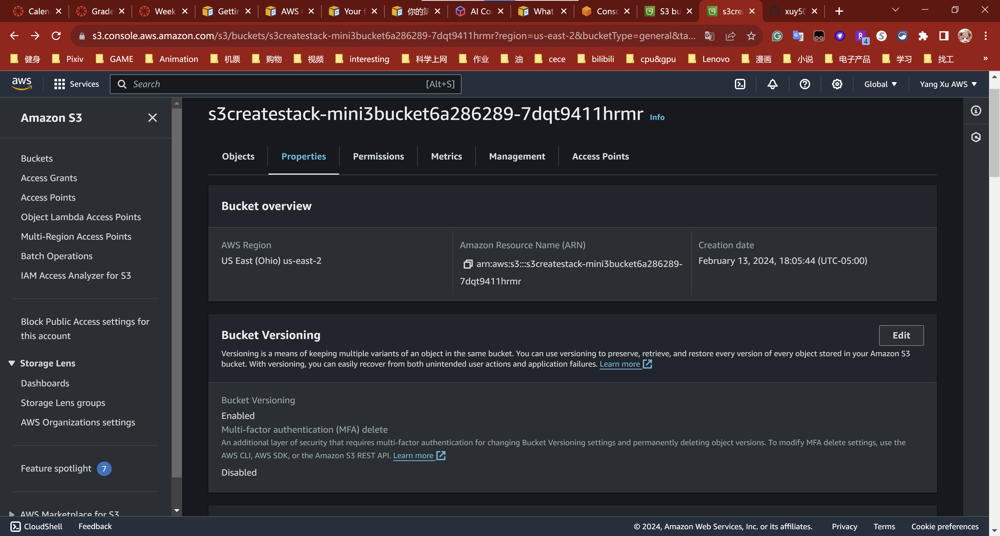
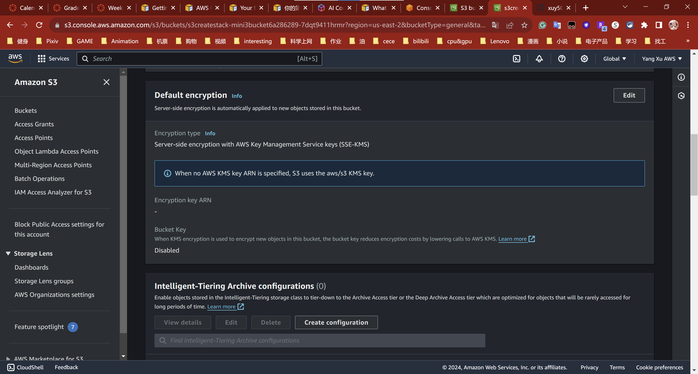

# ids721-mini3

## S3 Bucket Creation with AWS CDK and CodeWhisperer

This project demonstrates the creation of an Amazon S3 bucket using the AWS Cloud Development Kit (CDK) aided by AWS CodeWhisperer's AI-powered coding suggestions.

## Getting started with the AWS CDK Setup

Before beginning, ensure you have installed the necessary libraries and configured your AWS environment.

### Install aws-cdk-lib

```bash
npm install aws-cdk-lib
```

### Install TypeScript
- TypeScript 3.8 or later (npm -g install typescript)

```bash
npm install -g typescript
```

### Start an AWS access portal session

- Before accessing AWS services, you need an active AWS access portal session for the AWS CDK to use IAM Identity Center authentication to resolve credentials. Depending on your configured session lengths, your access will eventually expire and the AWS CDK will encounter an authentication error. Run the following command in the AWS CLI to sign in to the AWS access portal.

```bash
aws sso login
```

- If your SSO token provider configuration is using a named profile instead of the default profile, the command is aws sso login --profile NAME. Also specify this profile when issuing cdk commands using the --profile option or the AWS_PROFILE environment variable.

- To test if you already have an active session, run the following AWS CLI command.

```bash
aws sts get-caller-identity
```

The response to this command should report the IAM Identity Center account and permission set configured in the shared config file.

### Install the AWS CDK

- Install the AWS CDK Toolkit globally using the following Node Package Manager command.

```bash
npm install -g aws-cdk
```

- Run the following command to verify correct installation and print the version number of the AWS CDK.

```bash
cdk --version
```

### Bootstrapping

- Deploying stacks with the AWS CDK requires dedicated Amazon S3 buckets and other containers to be available to AWS CloudFormation during deployment. Creating these is called bootstrapping. To bootstrap, issue:

```bash
cdk bootstrap aws://ACCOUNT-NUMBER/REGION
```


## Create the Project
```bash
mkdir yourproject
cd yourproject
```
Now initialize the app by using the cdk init command. Specify the desired template ("app") and programming language as shown in the following examples:

```bash
cdk init app --language typescript
```
### Build the App

- In most programming environments, after changing your code, you build (compile) it. This isn't strictly necessary with the AWS CDK—the Toolkit does it for you so that you can't forget. But you can still build manually whenever you want to catch syntax and type errors. For reference, here's how.

```bash
npm run build
```

### Creating a New S3 Bucket with CDK

I generated my own stack project `S3CreateStack` class in the TypeScript code is responsible for provisioning an S3 bucket with specific properties such as versioning and encryption.

You will get the template for the stack main code.

```typescript
import * as cdk from 'aws-cdk-lib';
import { aws_s3 as s3 } from 'aws-cdk-lib'; // ** the lib for s3

export class HelloCdkStack extends cdk.Stack {
  constructor(scope: cdk.App, id: string, props?: cdk.StackProps) {
    super(scope, id, props);

    new s3.Bucket(this, 'MyFirstBucket', {
      versioned: true
    });
  }
}
```

- The code in the s3 bucket to add encryption for the new bucket.

```bash
encryption: s3.BucketEncryption.KMS_MANAGED
```

### Synthesize an AWS CloudFormation template

- Synthesize an AWS CloudFormation template for the app, as follows.

```bash
cdk synth
```

- If your app contained more than one stack, you'd need to specify which stack or stacks to synthesize. But since it only contains one, the CDK Toolkit knows you must mean that one.

### Deploying the stack

- To deploy the stack using AWS CloudFormation, issue:

```bash
cdk deploy
```

- As with cdk synth, you don't need to specify the name of the stack since there's only one in the app. It is optional (though good practice) to synthesize before deploying. The AWS CDK synthesizes your stack before each deployment. If your code has security implications, you'll see a summary of these and need to confirm them before deployment proceeds. This isn't the case in our stack. cdk deploy displays progress information as your stack is deployed. When it's done, the command prompt reappears. You can go to the AWS CloudFormation console and see that it now lists HelloCdkStack. You'll also find MyFirstBucket in the Amazon S3 console. You've deployed your first stack using the AWS CDK—congratulations! But that's not all there is to the AWS CDK.

### Modifying the app

- The AWS CDK can update your deployed resources after you modify your app. Let's change the bucket so it can be automatically deleted when deleting the stack. This involves changing the bucket's RemovalPolicy. Also, use the autoDeleteObjects property to ask the AWS CDK to delete the objects from the bucket before destroying it. (AWS CloudFormation doesn't delete S3 buckets that contain any objects.)

<br>

`Update lib/hello-cdk-stack.ts.`

```typescript
new s3.Bucket(this, 'MyFirstBucket', {
  versioned: true,
  removalPolicy: cdk.RemovalPolicy.DESTROY,
  autoDeleteObjects: true
});
```

- Here, we haven't written any code that, in itself, changes our Amazon S3 bucket. Instead, our code defines the desired state of the bucket. The AWS CDK synthesizes that state to a new AWS CloudFormation template. Then, it deploys a change set that makes only the changes necessary to reach that state.

### Destroying the app's resources
- Now that you're done with the quick tour, destroy your app's resources to avoid incurring any costs from the bucket you created, as follows.

```bash
cdk destroy
```

Enter y to approve the changes and delete any stack resources.


## Usage of CodeWhisperer

AWS CodeWhisperer was used to generate the CDK code. It provided intelligent code suggestions, accelerating the development process and ensuring adherence to best practices.
We can use it in the editors we are using. We can ask the Amazon Q chat about any question we want to know. We also can add comments and the CodeWhisperer will recognize them and autogenerate the codes we need.


## Results Screenshots

Below are screenshots illustrating key steps and outcomes in the project.

### Screenshot: CodeWhisperer Code Generation
Displayed here is the use of AWS CodeWhisperer to generate the CDK code for creating the S3 bucket.


### Screenshot: S3 Bucket Create Code Deploy Command
The final screenshot shows the terminal with the deployment commands executed to create the S3 bucket using the AWS CDK.


### Screenshot: Bucket Deployed
This image captures the successful deployment of the S3 bucket as seen in the AWS Management Console.


### Screenshot: Bucket Versioning Enabled
Here, we see the S3 bucket with versioning enabled, ensuring that each object can have multiple versions within the bucket.


### Screenshot: Bucket Default Encryption Set
This screenshot shows the S3 bucket with the default encryption set to use AWS Key Management Service keys (SSE-KMS).


